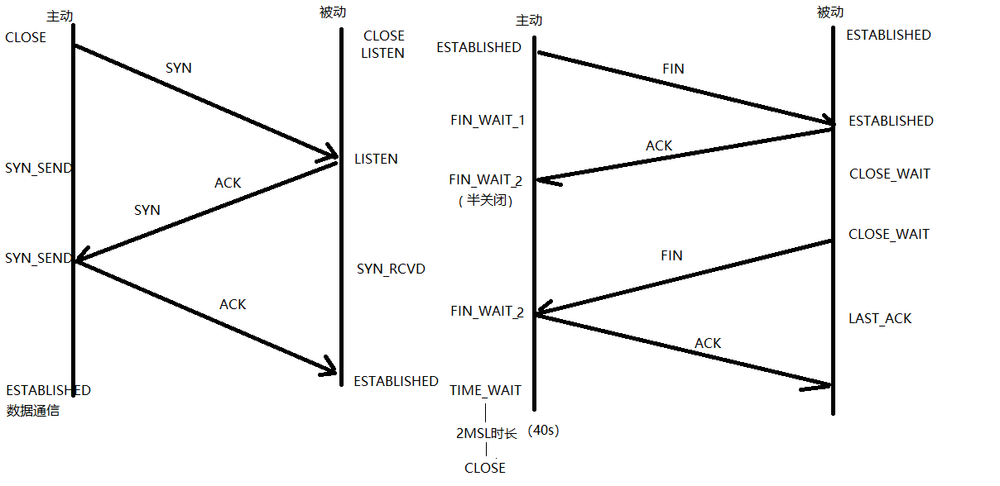
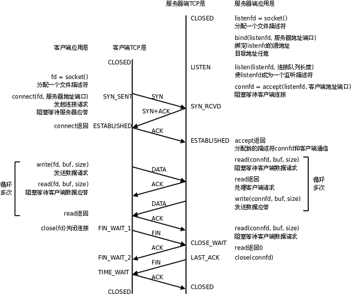

## **传输层-UDP协议**

- 16位：源端口号	2^16 = 65536 
- 16位：目的端口号


## **传输层-TCP协议**

### **结构**

```
- 16位：源端口号    2^16 = 65536  

- 16位：目的端口号

- 32序号

- 32确认序号

- 6个标志位

- 16位窗口大小    2^16 = 65536
```

### **三次握手**

#### **流程**

- 主动发起连接请求端，发送 SYN 标志位，请求建立连接
  - 携带序号、数据字节数、滑动窗口大小


- 被动接受连接请求端 SYN，发送 ACK 标志位，同时携带 SYN 请求标志位
  - 携带序号、确认序号、数据字节数、滑动窗口大小


- 主动发起连接请求端，发送 ACK 标志位，应答服务器连接请求
  - 携带确认序号

### **四次挥手**

#### **流程**

- 主动关闭连接请求端， 发送 FIN 标志位
- 被动关闭连接请求端， 应答 ACK 标志位
  - 主动方收到被动方发的ACK报文后，进入半关闭状态
- 被动关闭连接请求端， 发送 FIN 标志位
- 主动关闭连接请求端， 应答 ACK 标志位
  - 主动方发送ACK报文后，进入wait 2MSL
  - 被动方收到主动方ACK后 关闭

### **半关闭**

#### **简述**

- 发生在主动关闭方
- 主动方发送 FIN 报文，被动发回复 ACK 报文，主动方收到ACK报文后，状态变为半关闭状态
- 半关闭表示主动方关闭了写缓冲区，表示不再向被动方发送数据处理相关的报文了，但是主动方可以回复被动方最后发来的 FIN 操作


#### **shutdown**函数

	shutdown在关闭多个文件描述符应用的文件时，采用全关闭方法
	close，只关闭一个：close（cfd）
	
	shutdown(int fd, int how)
	
		how:SHUT_RD	关读端
	
			SHUT_WR	关写端
	
			SHUT_RDWR 关读写

### **2MSL**

- 发生在主动关闭连接请求端，40s左右
- 对应 TIME_WAIT 状态

- 保证四次挥手中主动方最后一次发的 ACK 能成功被对端接收
  - 被动方如果没有收到ACK，会继续发送FIN
  - 一次ACK 和FIN在通信中存活的一个周期为1MSL，因此等待2MSL正好可以完成一次正常的发送和接收，如果在2MSL期间没有收到对端发来的FIN，表示对端已经成功收到

### **滑动窗口**

- 在发送报文的过程中会发送给连接对端，本端的实时缓冲区大小


**好处**

- **提升性能**
  - 缓解接收端和发送端处理速度不匹配的问题
  - 发送端可以分多次发送一段连续的数据报文给接收端，接收端收到后，可以回复一个报文给发送端，而不用对于每一个发送都进行回复
- **保证数据不会丢失**
  - 发送端如果处理速度较快，接收端较慢的话，发送端较快的发送很容易把接收端缓冲区填满，之后要么会溢出丢失数据要么会造成阻塞

### **端口复用**

- 主动方主动关闭后，会等待2MSL后再关闭，此时主动方会占用之前的端口，造成无法使用，需等待2MSL时间后才可以使用

**解决方法**

- 设置端口为可复用的

	int opt = 1;		// 设置端口复用，1取值为设置端口复用，0表示不设置
	
	setsockopt(lfd, SOL_SOCKET, SO_REUSEADDR, (void *)&opt, sizeof(opt));

### **TCP 三次握手 四次挥手状态变化**

**主动方**

- 主动发起连接请求端

  CLOSED -- 发送SYN -- SEND_SYN -- 接收 ACK、SYN -- SEND_SYN -- 发送 ACK -- **ESTABLISHED**（数据通信态）

- 主动关闭连接请求端

  **ESTABLISHED**（数据通信态） -- 发送 FIN -- FIN_WAIT_1 -- 接收ACK -- FIN_WAIT_2（半关闭）
  	-- 接收对端发送 FIN -- **FIN_WAIT_2**（半关闭）-- 回发ACK -- **TIME_WAIT**（半关闭 等待2MSL时长）-- CLOSED


**被动方**

- 被动接收连接请求端

  CLOSE -- LISTEN -- 接收 SYN -- LISTEN -- 发送 ACK、SYN -- SYN_RCVD -- 接收ACK -- **ESTABLISHED**（数据通信态）

- 被动关闭连接请求端

  **ESTABLISHED**（数据通信态）-- 接收 FIN -- ESTABLISHED（数据通信态） -- 发送ACK

  -- CLOSE_WAIT (说明 主动关闭连接端 处于半关闭状态) -- 发送FIN -- LAST_ACK -- 接收ACK -- CLOSED


**根据端口查询当前状态**

- netstat -apn | grep  端口号


**相关图片**








