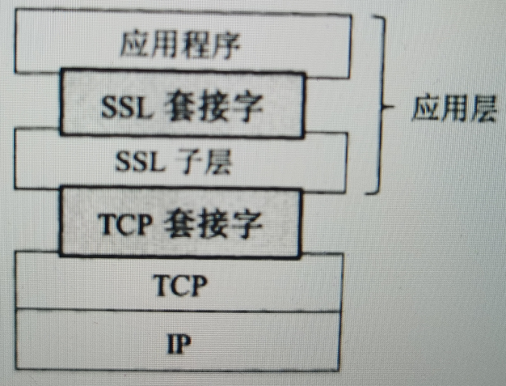

## **http**

- 应用层超文本传输协议
- 应用于一种无状态、无连接(1.0之前)，以请求和应答方式运行的协议

## **https**

### **出现的原因**

**安全性**

- http协议不安全、未加密，在网络传输的过程中容易被黑客截获
- https 在应用层中加入了SSL子层，用于对报文进行加密传输

### **实现**

- 在应用层和传输层之间，加入了SSL子层，归属于应用层
- 对应用层的数据进行加解密安全传输

## **SSL TLS**

### **简述**

- **SSL**： Secure Socket Layer，安全套接字层
- 作用在应用层的HTTP和传输层之间，在TCP之上建立安全通道，为通过TCP传输的应用层数据提供安全保障
- TLS：Transport Layer Security，运输层安全

- **TLS**在SSL 3.0基础上进行设计，是SSL 3.0的升级版本

- 包含**记录协议**和**握手协议**

  - SSL记录协议（SSL Record Protocol）：它建立在可靠的传输协议（如TCP）之上，为高层协议提供数据封装、压缩、加密等基本功能的支持
  - SSL握手协议（SSL Handshake Protocol）：它建立在SSL记录协议之上，用于在实际的数据传输开始前，通讯双方进行身份认证、协商加密算法、交换加密密钥等

  

### **原理**

- SSL身份认证，认证完成后开始传输

**发送方**

- SSL 子层 通过SSL套接字接收来自应用层的数据（如HTTP和IMAP报文）
- 在SSL子层对数据进行加密，然后传给TCP套接字

**接收方**

- SSL子层 从TCP套接字读取数据
- 解密后，通过SSL套接字把数据传递给应用层

### **关键步骤**

- server端传递 **数字证书** 到client，client接收到server端的数字证书
  - 其中数字证书中包括：CA相关信息、server端的公钥、数字签名等
- client端 收到server端公钥后，用该公钥对 **会话密钥** 进行加密传递给server端
  - 会话密钥用于之后数据安全传输
- server端收到加密后的**会话密钥**，用自己的私钥进行解密
  - 会话密钥的加解密过程属于**非对称加解密算法**
- 数据传输
  - 用会话密钥，在client端和server端用**对称加解密算法**进行加密传输

## **对称加密算法**

### **简述**

- 加密和解密用相同的密钥

### **优点**

- **高效** 适用于大量数据加密的场景

### **问题**

- 算法公开，安全性取决于密钥的大小，密钥越大越安全效率也会越低，因此要在安全性和效率之间做权衡

### **缺点**

- **安全性问题**	算法加解密本身是安全的，但是对称加密需要的是加解密用同一密钥，这就要求客户端服务器端使用同一密钥，网络传输的过程中不仅要传输密文，同样传输密钥，如果密文、密钥同时被黑客截获，造成不安全性

### **相关算法**

- DES：Date Encryption Standard
- 3DES：Triple DES
- AES：Advanced Encryption Standard

## **非对称加密算法**

### **简述**

- 加密和解密用的不同密钥，公钥加密，私钥解密
- 数字签名：用于证明数据发送方主体身份
- 数字证书：安全性认证保护传输，其中包含了数字签名、server端公钥等信息

### **优点**

- **安全性高** 公钥加密的数据只有对应的私钥才能解密

### **缺点**

- 加解密复杂、效率低、耗时较长

### **相关算法**

- RSA
- DSA
- ECC
- DH